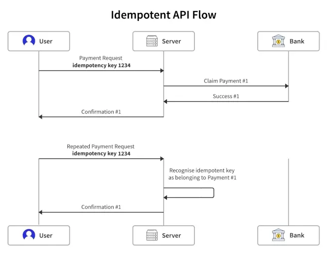
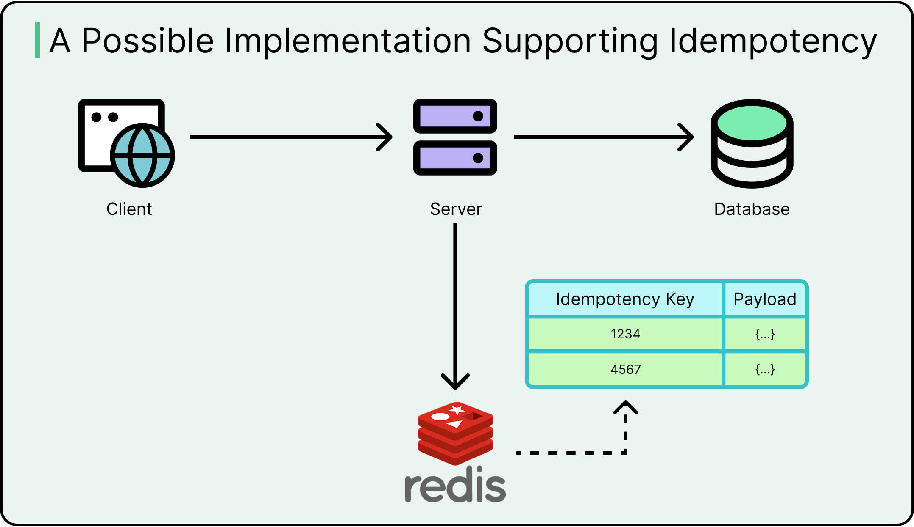

# Idempotency in REST APIs

## What is Idempotency?

**Idempotency** means a request can be retried safely because repeating it won’t change the final result.

## What is an Idempotent REST API?

**Idempotent REST API** means that if the same request is made a number of times then it will have the same impact as making the request just once. 

### Key Points

- Idempotency is **not** about "server runs only once"
- It's about the **final effect** remaining the same no matter how many times you repeat the request

### Examples

- `GET /users/5` → Returns the same user every time
- `PUT /user/5` with the same body → Update happens again, but the final saved data is the same

## Why Do POST Requests Need Idempotency?

POST is **NOT idempotent by default**, which can cause problems:

- Creating an order 2 times → 2 orders created
- Paying twice → Double charge
- Creating a booking → Duplicate tickets

### Solution

For POST requests, we implement **manual idempotency** using:

- **Idempotency-Key** (UUID from client)
- **Cache** (Redis) or database locks

This prevents duplicate operations when users retry.

## When is Idempotency Needed?

Common scenarios that require idempotency:

- User double-clicks "Pay" button
- Network timeout → App retries automatically
- Mobile apps auto-retry failed API calls
- Gateway timeout (504 error)
- Poor internet connection → Multiple retries

**Result:** Ensures no duplicate payments or duplicate orders

## When to Use Idempotency?

Use idempotent POST when the request must run **only once**:

- Payments
- Order creation
- Booking systems
- Wallet recharge
- Subscriptions
- Email sending (rare cases)

## How Idempotent POST Works

### Concept Flow

1. **Client generates a UUID**

   ```
   Idempotency-Key: <uuid>
   ```

2. **Client sends request** with this header

3. **Server checks Redis:**

   - If key exists → Return the saved response
   - If not → Process the business logic and store the response

4. **On retry** → Server returns same response → No duplicate action

### Detailed Flow

1. Client sends `POST` with `Idempotency-Key: <uuid>`

2. Server checks Redis for this key:

   - **If found** → Return cached response
   - **If not found:**
     - Run business logic
     - Save response in Redis

3. Any retries with the same key → Same response is returned

## Important Rules

- Idempotency key must be **unique per logical operation**
- Must have **TTL** (Time To Live, e.g., 24 hours)
- Server must return the **same exact previous response** on retry
- Use Redis `SETNX` or `NX` flag to prevent race conditions

## Implementation Example (Node.js + Redis)

This is the exact pattern used in **Stripe** and **Razorpay**.

### 1. Redis Client

```javascript
import Redis from "ioredis";
export const redis = new Redis();
```

### 2. Middleware - Check Lock + Cache

```javascript
export const checkIdempotency = async (req, res, next) => {
  const key = req.headers["idempotency-key"];

  if (!key) {
    return res.status(400).json({ message: "Idempotency-Key header required" });
  }

  const cached = await redis.get(key);

  if (cached && cached !== "PROCESSING") {
    // Return previously saved response
    return res.status(200).json(JSON.parse(cached));
  }

  // Prevent race conditions
  const lock = await redis.set(key, "PROCESSING", "NX", "EX", 60);

  if (!lock) {
    // Another request is processing → Send "in progress"
    return res.status(409).json({ message: "Request already being processed" });
  }

  req.idempotencyKey = key;
  next();
};
```

### 3. Controller

```javascript
app.post("/api/create-order", checkIdempotency, async (req, res) => {
  const key = req.idempotencyKey;

  // Business logic
  const order = {
    orderId: Math.floor(Math.random() * 100000),
    amount: 499,
    status: "SUCCESS",
  };

  // Save final result with 24-hour expiry
  await redis.set(key, JSON.stringify(order), "EX", 60 * 60 * 24);

  return res.status(201).json(order);
});
```

## Client Retry Scenario

### First Request

```http
POST /api/create-order
Idempotency-Key: aa1b1af1-2df4-4dd3-b318-f0f7d34f32c1
```

→ Server processes order → Returns response

### User Retries (Same Key)

→ Same key sent  
→ Same result returned from cache  
→ **No duplicate order created**

## Summary (Interview Answer)

- **Idempotency** means the final result remains the same even if the same request is sent multiple times
- `GET` and `PUT` are naturally idempotent because repeating them doesn't change the final state
- `POST` is **not idempotent**, so we add an `Idempotency-Key` (UUID) + Redis cache to ensure duplicate retries don't cause double orders or double payments



